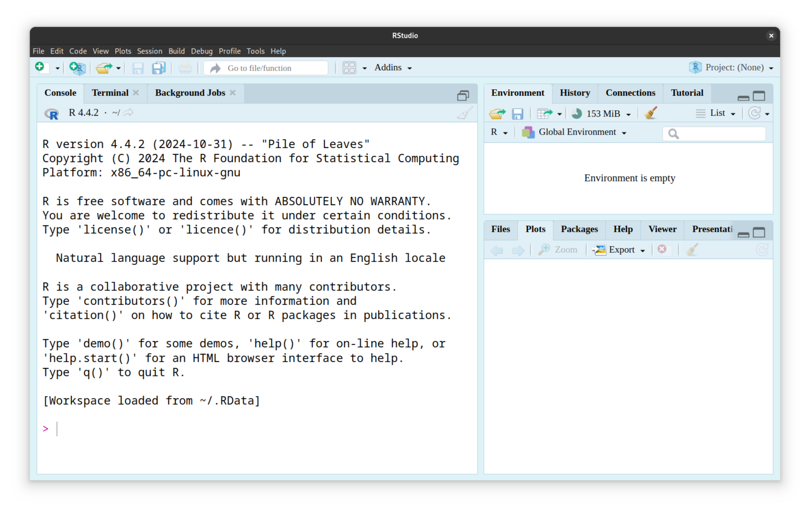
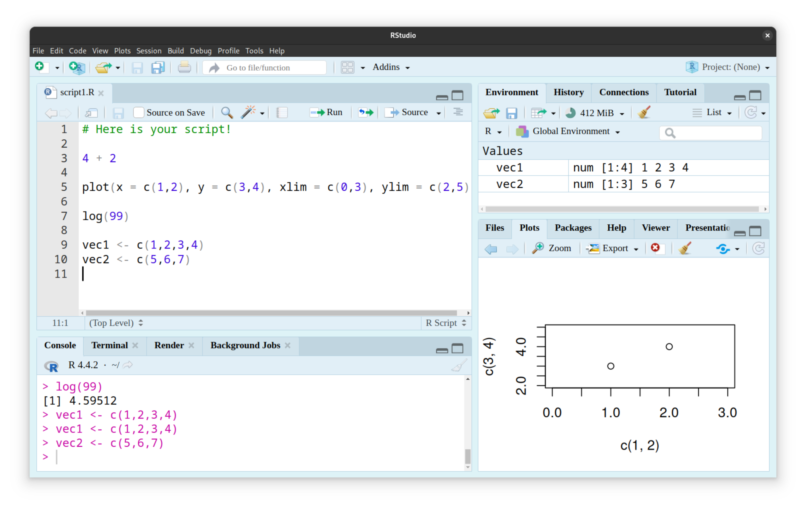

\newpage

**Author**

Claire Descombes, MSc Statistics and Data Science UniBe, [claire.descombes@insel.ch](mailto:claire.descombes@insel.ch).

# Objectives

The aim of this introduction to R for physicians is to

-   explain the basics of coding in R resp. RStudio
-   present a number of nice plotting features provided by `ggplot2`
-   introduce a number of statistical tests commonly used in medicine

# Basics of coding in R

R is a free and open source statistical computing and graphics software.
RStudio is a user-friendly environment for R, designed to facilitate its accessibility. 
R can technically be used without RStudio (although I wouldn't advise it), but the reverse is not possible. 
To download both, follow the links below:

* [**Download R**](https://stat.ethz.ch/CRAN/)
* [**Download RStudio**](https://posit.co/download/rstudio-desktop/)

Once you have downloaded both programs and opened RStudio, you will be presented with a window similar to the one shown in Figure \ref{fig:rstudio-window-start}.

 

* Left pane: Contains the Console, Terminal and Background Jobs tabs.
* Top right pane: contains the Environment, History, Connections and Tutorial tabs.
* Bottom right pane: contains the Files, Plots, Packages, Help, Viewer and Presentation tabs.

## Console

In the **Console tab**, we first see information about the version of R we are using and some basic commands to try out. At the end of these descriptions, we can type our R code, press Enter and see the result below the code line.

\vspace{0.2cm}


```r
2+2
```

```
## [1] 4
```

## Help

The `help()` function and `?` help operator in R provide access to the documentation pages for R functions, data sets, and other objects, both for packages in the standard R distribution and for contributed packages.

You can access help directly from the console or via the Help tab in the bottom right-hand corner.

\vspace{0.2cm}


```r
help(c)
# or equivalently
? c
```

## Script file

However, when we run our code directly in the console, it isn't saved for being reproduced further. If we need (and we usually do) to write a reproducible code to solve a specific task, we have to record and regularly save it in a **script file** rather than in the console.

To start recording a script, click *File – New File – R Script*. This will open a text editor in the top-left corner of the RStudio interface (above the Console tab, see Figure \ref{fig:rstudio-window}).

 

## Comments

Comments can be added to the code in a script using the hash symbol.

\vspace{0.2cm}


```r
# Here is your script.
```

It is very, very important that you always comment every piece of your code, to make sure:

* that you will still be able to understand what you have written after a few months/years.
* to facilitate sharing: without comments, it will take someone much longer to understand your code.

So for scientific purposes, please **comment your code**!

## Objects, data types, variables

In R, everything is an **object**. This means that every piece of data you work with, from a single number to a complex dataset, is represented as an object with specific properties and behaviours. An object has attributes like class (data type) and dimensions.

**Variables** are labels: They act as pointers to the actual object stored in memory, and appear in the Environment tab.

To better grasp the difference, here is an example.

\vspace{0.2cm}


```r
# We create an object named 'vec' and assign a sequence of numbers to it.
vec <- 1:10 

# 'vec' is the variable. The sequence of numbers (1, 2, 3, ..., 10) is the object.
```

To assign values to an object, use the '<-' or '=' symbols.

### Data types

In R, data types define the kind of information a variable can hold. Here are some of the key data types:

* Numeric: Represents real numbers (e.g., 3.14, -2.5, 0).

\vspace{0.2cm}
        

```r
typeof(3.14) 
```

```
## [1] "double"
```

* Integer: Represents whole numbers (e.g., 2L, -5L). The "L" suffix indicates an integer.

\vspace{0.2cm}


```r
typeof(2L) 
```

```
## [1] "integer"
```

* Logical: Represents Boolean values (TRUE or FALSE).

\vspace{0.2cm}


```r
typeof(TRUE)
```

```
## [1] "logical"
```

* Character: Represents text or strings (e.g., "hello", "world").

\vspace{0.2cm}


```r
typeof("hello")
```

```
## [1] "character"
```

* Complex: Represents complex numbers (e.g., 1 + 2i).

\vspace{0.2cm}


```r
typeof(1 + 2i) 
```

```
## [1] "complex"
```

#### NAs/NANs

In R, missing values are represented by the symbol NA (not available). Impossible values (e.g., dividing by zero) are represented by the symbol NaN (not a number). Unlike SAS, R uses the same symbol for character and numeric data.

### Objects

* Vectors:
  + The most fundamental data structure.
  + A one-dimensional array of elements of the same data type (e.g., numeric, character, logical).
  + Created using the `c()` function.
  
\vspace{0.2cm}


```r
vec1 <- c(1,2,3)
vec1
```

```
## [1] 1 2 3
```

```r
# Or equivalently (only for integers!)
vec2 <- 1:3
vec2
```

```
## [1] 1 2 3
```

```r
# Or equivalently (only for equally spaced values!)
vec3 <- seq(from=1, to=3, by=1)
vec3
```

```
## [1] 1 2 3
```

```r
# To look only at some elements in the vector, we can specify
# which indices we are interested in inside brackets [].
# (Note: in R, indices start with 1.)
vec1[1]
```

```
## [1] 1
```

```r
vec2[c(2,3)]
```

```
## [1] 2 3
```

* Matrices:
  + Two-dimensional arrays of elements of the same data type.
  + Can be created using the `matrix()` function.
  
\vspace{0.2cm}
  

```r
mat <- matrix(c(1,2,3,4), nrow = 2, ncol = 2)
mat
```

```
##      [,1] [,2]
## [1,]    1    3
## [2,]    2    4
```

* Arrays:
  + Generalization of matrices to multiple dimensions.
  
\vspace{0.2cm}


```r
array <- array(1:8, c(2,4,2))
array
```

```
## , , 1
## 
##      [,1] [,2] [,3] [,4]
## [1,]    1    3    5    7
## [2,]    2    4    6    8
## 
## , , 2
## 
##      [,1] [,2] [,3] [,4]
## [1,]    1    3    5    7
## [2,]    2    4    6    8
```

* Data Frames:
  +Two-dimensional tabular data structure.
  + Can hold columns of different data types.
  + The most common data structure for representing datasets in R.
  
\vspace{0.2cm}


```r
d <- data.frame(id = 1:10, val = c(4,5,2,6,7,9,3,5,8,7))
d
```

```
##    id val
## 1   1   4
## 2   2   5
## 3   3   2
## 4   4   6
## 5   5   7
## 6   6   9
## 7   7   3
## 8   8   5
## 9   9   8
## 10 10   7
```

* Lists:
  + Ordered collections of objects of any type (including other lists).
  + Can hold elements of different data types within a single list.
  
\vspace{0.2cm}


```r
list <- list(numb = 10:15, char = 'hello')
list
```

```
## $numb
## [1] 10 11 12 13 14 15
## 
## $char
## [1] "hello"
```

* Factors:
  + Categorical variables.
  + Represent data with a limited number of possible values.

\vspace{0.2cm}
  

```r
fac <- factor(c("single", "married"))
fac
```

```
## [1] single  married
## Levels: married single
```

* Functions:
  + Reusable blocks of code that perform a specific task.
  + Also considered objects in R.

\vspace{0.2cm}
  

```r
frac <- function(nominator, denominator) {
  res <- nominator/denominator
  return(res)
}
frac(6,2)
```

```
## [1] 3
```

## Working directory

When you get a file from somewhere on your computer (e.g. a dataset), you can either 

* have it in your **R working directory** (see below), in which case you don't need to specify the full path to the file when you import it, 
* or you can get files in different folders, by always specifying the full path.

The advantage of putting the files in the folder that contains your script and is set as the working directory is that you can easily move the folder around on your computer without getting any problems with your script: just set the working directory to your source file every time you open it, and you'll be fine.

\vspace{0.2cm}


```r
# Example
setwd("~home/user/Documents/Trials/VANCO/Analysis5")
data <- read.csv("testdata.csv")
```

The advantage of always giving the full path to a file is that you can get data in different folders on your computer, avoiding things like copying the source data in every folder where you have a corresponding script.

\vspace{0.2cm}


```r
# Example
data <- read.csv("/home/user/Documents/Trials/VANCO/Data/testdata.csv")
```

**Working directory**

To tell R which folder you are working in (e.g. where you have your data), you can either go to *Session - Set working directory - Choose directory* and choose the folder you want, or use the `setwd()` function, or more directly set your working directory to the folder where your R script is located, via *Session - Set working directory - To source file location*.

I personally recommend that you put your script in the folder you set as your working directory, to avoid forgetting where the script has to look for data.

## Import data

We will study the case CSV to R data frame.

CSV is expanded as Comma, Separated, Values. In a CSV file, the values stored are separated by a comma. This process of storing the data is much easier.

After the setting of the working path/determining the path of your CSV file, you can import your data set using the function `read.csv`, which should always create a data frame. To check the class of the variable ‘readfile’, use the function `class'.

\vspace{0.2cm}


```r
dataset <- read.csv("testdata.txt")
class(dataset)
```

I recommend using data frames for your data, it is a much easier format to understand than matrices if you are not used to it.

## Data frames

Let us now look at a data frame to learn how to call or modify its elements. To do this, we will use a data set available in Base R.


```r
data.diamonds <- diamonds
class(data.diamonds) # we check the class
```

```
## [1] "tbl_df"     "tbl"        "data.frame"
```

```r
head(data.diamonds) # we look at the first rows
```

```
## # A tibble: 6 x 10
##   carat cut       color clarity depth table price     x     y     z
##   <dbl> <ord>     <ord> <ord>   <dbl> <dbl> <int> <dbl> <dbl> <dbl>
## 1  0.23 Ideal     E     SI2      61.5    55   326  3.95  3.98  2.43
## 2  0.21 Premium   E     SI1      59.8    61   326  3.89  3.84  2.31
## 3  0.23 Good      E     VS1      56.9    65   327  4.05  4.07  2.31
## 4  0.29 Premium   I     VS2      62.4    58   334  4.2   4.23  2.63
## 5  0.31 Good      J     SI2      63.3    58   335  4.34  4.35  2.75
## 6  0.24 Very Good J     VVS2     62.8    57   336  3.94  3.96  2.48
```
**Diamonds**: *A dataset containing the prices and other attributes of almost 54,000 diamonds. The variables are as follows: price, carat, cut, color, clarity, x, y, z, depth, table.*

\vspace{0.2cm}


```r
# To inspect one columns, we can use the dollar $ symbol.
# (Let us only look at the first 10 entries).
data.diamonds$carat[1:10]
```

```
##  [1] 0.23 0.21 0.23 0.29 0.31 0.24 0.24 0.26 0.22 0.23
```

```r
# Alternatively, you can give the index of the desired column.
# As data frames are bi-dimentional, you need to specify in the brackets []
# a value for the rows and one for the columns.
data.diamonds[1:10, 1]
```

```
## # A tibble: 10 x 1
##    carat
##    <dbl>
##  1  0.23
##  2  0.21
##  3  0.23
##  4  0.29
##  5  0.31
##  6  0.24
##  7  0.24
##  8  0.26
##  9  0.22
## 10  0.23
```

```r
# If you don't give any value, you get all the rows/columns.
data.diamonds[1:10, ]
```

```
## # A tibble: 10 x 10
##    carat cut       color clarity depth table price     x     y     z
##    <dbl> <ord>     <ord> <ord>   <dbl> <dbl> <int> <dbl> <dbl> <dbl>
##  1  0.23 Ideal     E     SI2      61.5    55   326  3.95  3.98  2.43
##  2  0.21 Premium   E     SI1      59.8    61   326  3.89  3.84  2.31
##  3  0.23 Good      E     VS1      56.9    65   327  4.05  4.07  2.31
##  4  0.29 Premium   I     VS2      62.4    58   334  4.2   4.23  2.63
##  5  0.31 Good      J     SI2      63.3    58   335  4.34  4.35  2.75
##  6  0.24 Very Good J     VVS2     62.8    57   336  3.94  3.96  2.48
##  7  0.24 Very Good I     VVS1     62.3    57   336  3.95  3.98  2.47
##  8  0.26 Very Good H     SI1      61.9    55   337  4.07  4.11  2.53
##  9  0.22 Fair      E     VS2      65.1    61   337  3.87  3.78  2.49
## 10  0.23 Very Good H     VS1      59.4    61   338  4     4.05  2.39
```

Note that both approaches don't yield the same data format! When plotting/analysing, favour using the dollar sign.

Now, let us assume we want to modify one entry/multiple entries in our data frame. The brackets come in handy now. In this setting, I recommend defining a new data frame before modifying the original one.

Some examples follow.


```r
# Modification of one entry:
data.diamonds.mod <- data.diamonds
head(data.diamonds.mod)
```

```
## # A tibble: 6 x 10
##   carat cut       color clarity depth table price     x     y     z
##   <dbl> <ord>     <ord> <ord>   <dbl> <dbl> <int> <dbl> <dbl> <dbl>
## 1  0.23 Ideal     E     SI2      61.5    55   326  3.95  3.98  2.43
## 2  0.21 Premium   E     SI1      59.8    61   326  3.89  3.84  2.31
## 3  0.23 Good      E     VS1      56.9    65   327  4.05  4.07  2.31
## 4  0.29 Premium   I     VS2      62.4    58   334  4.2   4.23  2.63
## 5  0.31 Good      J     SI2      63.3    58   335  4.34  4.35  2.75
## 6  0.24 Very Good J     VVS2     62.8    57   336  3.94  3.96  2.48
```

```r
data.diamonds.mod[1,1] <- 0.4
head(data.diamonds.mod)
```

```
## # A tibble: 6 x 10
##   carat cut       color clarity depth table price     x     y     z
##   <dbl> <ord>     <ord> <ord>   <dbl> <dbl> <int> <dbl> <dbl> <dbl>
## 1  0.4  Ideal     E     SI2      61.5    55   326  3.95  3.98  2.43
## 2  0.21 Premium   E     SI1      59.8    61   326  3.89  3.84  2.31
## 3  0.23 Good      E     VS1      56.9    65   327  4.05  4.07  2.31
## 4  0.29 Premium   I     VS2      62.4    58   334  4.2   4.23  2.63
## 5  0.31 Good      J     SI2      63.3    58   335  4.34  4.35  2.75
## 6  0.24 Very Good J     VVS2     62.8    57   336  3.94  3.96  2.48
```

```r
# Modification of multiple entries (selecting by condition):
data.diamonds.mod[data.diamonds.mod$cut == 'Premium', ]$depth <- 3.00
head(data.diamonds.mod)
```

```
## # A tibble: 6 x 10
##   carat cut       color clarity depth table price     x     y     z
##   <dbl> <ord>     <ord> <ord>   <dbl> <dbl> <int> <dbl> <dbl> <dbl>
## 1  0.4  Ideal     E     SI2      61.5    55   326  3.95  3.98  2.43
## 2  0.21 Premium   E     SI1       3      61   326  3.89  3.84  2.31
## 3  0.23 Good      E     VS1      56.9    65   327  4.05  4.07  2.31
## 4  0.29 Premium   I     VS2       3      58   334  4.2   4.23  2.63
## 5  0.31 Good      J     SI2      63.3    58   335  4.34  4.35  2.75
## 6  0.24 Very Good J     VVS2     62.8    57   336  3.94  3.96  2.48
```

```r
# Suppression of rows with NAs
data.diamonds.noNA <- na.omit(data.diamonds)
```

## Packages

There are a set of standard (or base) packages which are considered part of the R source code and automatically available as part of your R installation. **Base packages** contain the basic functions that allow R to work, and enable standard statistical and graphical functions on datasets.

**Packages** are collections of R functions, data, and compiled code in a well-defined format, created to add specific functionality. There are 10,000+ user contributed packages and growing. You can install packages using the install.packages() function.

\newpage

# Including plots using ggplot2

The base `plot()` function works well and is easy to use, but is not as good looking as the geom functions provided by the `ggplot2` package.

**ggplot2** is a system for declaratively creating graphics, based on The Grammar of Graphics. You provide the data, tell ggplot2 how to map variables to aesthetics, what graphical primitives to use, and it takes care of the details.

\vspace{0.2cm}


```r
# The easiest way to get ggplot2 is to install the whole tidyverse:
install.packages("tidyverse")

# Alternatively, install just ggplot2:
install.packages("ggplot2")
```

To explore the potential of `ggplot2`, we start by importing data sets (which are included in Base R).

\vspace{0.2cm}


```r
data.iris <- iris
head(data.iris) # to have a look at the first few rows
```

```
##   Sepal.Length Sepal.Width Petal.Length Petal.Width Species
## 1          5.1         3.5          1.4         0.2  setosa
## 2          4.9         3.0          1.4         0.2  setosa
## 3          4.7         3.2          1.3         0.2  setosa
## 4          4.6         3.1          1.5         0.2  setosa
## 5          5.0         3.6          1.4         0.2  setosa
## 6          5.4         3.9          1.7         0.4  setosa
```

```r
data.cars <- cars
head(data.cars)
```

```
##   speed dist
## 1     4    2
## 2     4   10
## 3     7    4
## 4     7   22
## 5     8   16
## 6     9   10
```

**Iris**: *This famous (Fisher's or Anderson's) iris data set gives the measurements in centimeters of the variables sepal length and width and petal length and width, respectively, for 50 flowers from each of 3 species of iris. The species are Iris setosa, versicolor, and virginica.*

**Cars**: *The data give the speed of cars and the distances taken to stop. Note that the data were recorded in the 1920s.*

ggplot2 is based on the grammar of graphics, the idea that you can build every graph from the same components: 

* a data set, 
* a coordinate system, 
* and geoms—visual marks that represent data points.
 
To display values, map variables in the data to visual properties of the geom (aesthetics) like size, color, and x and y locations.


\includegraphics[width=0.5\linewidth]{ggplot2-structure} 

Absolutely unavoidable are the 

* data: our data set
* geom function: geom_point(), geom_line(), geom_histogram(), geom_bar(), geom_qq(), etc.
* and mappings: color, filling, linetype, linewidth, etc.

The geom function must be chosen according to the type of data examined (two continuous variables, one categorical and one continuous variable, etc.).

The best way to understand how to use ggplot2 is to look at some examples.


```r
# For comparison, let us start by plotting the petal length against the petal width using
# the Base R plot() function.
plot(x = data.iris$Sepal.Length, y = data.iris$Sepal.Width)
```


\includegraphics[width=0.75\linewidth]{R_for_physicians_files/figure-latex/unnamed-chunk-25-1} 

```r
# Now we will use the ggplot2 package. We plot again the petal length against the petal 
# width.
plot <- ggplot(data = data.iris) +
  geom_point(mapping = aes(x = Petal.Length, y = Petal.Width))
plot
```


\includegraphics[width=0.75\linewidth]{R_for_physicians_files/figure-latex/unnamed-chunk-25-2} 

```r
# Our plot can be made much nicer using optional features.
nice.plot <- ggplot(data = data.iris) +
  geom_point(mapping = aes(x = Petal.Length, y = Petal.Width, color = Species)) +
  labs(x = "Petal length (cm)", y = "Petal width (cm)", 
       title = "Petal length against petal width") +
  theme_minimal()
nice.plot
```


\includegraphics[width=0.75\linewidth]{R_for_physicians_files/figure-latex/unnamed-chunk-25-3} 

```r
plot2 <- ggplot(data = data.cars) +
  geom_line(mapping = aes(x = speed, y = dist), color = "brown1", linewidth = 1) +
  geom_point(mapping = aes(x = speed, y = dist), color = "brown2", size = 1) +
  theme(legend.position = "top") +
  theme_minimal() +
  labs(x = "Speed (mph)", y = "Distance to stop (ft)", 
       title = "Relationship between speed and stopping distance")
plot2
```


\includegraphics[width=0.75\linewidth]{R_for_physicians_files/figure-latex/unnamed-chunk-25-4} 

```r
plot3 <- ggplot(data = data.iris) +
  geom_histogram(mapping = aes(Petal.Length, fill = Species), 
                 color = "white", bins = 20) +
  theme(legend.position = "top") +
  theme_minimal() +
  labs(x = "Petal length (cm)", y = "Petal width (cm)", 
       title = "Petal length distribution by species") +
  facet_wrap(~ Species)
plot3
```


\includegraphics[width=0.75\linewidth]{R_for_physicians_files/figure-latex/unnamed-chunk-25-5} 

\newpage

# Most commonly used statistical tests

| Section | Topic | Subtopics |
|---------|-------|-----------|
| **4.1 Tests for comparing two groups** | Tests comparing means or proportions between two groups | Student’s t-Test, Wilcoxon-Mann-Whitney Test (Mann-Whitney-U-Test), Fisher’s Exact Test, McNemar Test |
| **4.2 Tests for more than two groups** | Tests for comparing multiple groups | Kruskal-Wallis Test, Friedman Test, Pearson’s Chi-Square Test |
| **4.3 Tests for distribution and normality** | Tests for distribution of data | Lilliefors/ Kolmogorov-Smirnov-Lilliefors Test |
| **4.4 Tests for survival analysis** | Tests for time-to-event data | Logrank/ Log-Rank Test |
| **4.5 Correlation and association tests** | Tests for relationships between variables | Correlation test by Pearson, Correlation test by Spearman |
| **4.6 Predictive modeling and regression** | Predictive models and regression techniques | Generalized Linear Models (GLMs) (Linear Regression - Logistic Regression - Cox Proportional Hazards Regression - Multivariable Regression) Mixed Effects Models, Generalized Additive Models (GAMs), Generalized Additive Mixed Models (GAMMs) |

## Tests for comparing two groups

### Student's t-Test

Basis for comparing means of two groups.
Introduce first as it’s widely used and foundational.

### Wilcoxon-Mann-Whitney Test (Mann-Whitney-U-Test)

Presented as the non-parametric alternative to the t-Test.

### Fisher's Exact Test

Focus on categorical variables and small sample sizes.

### McNemar Test

Highlight its application for paired categorical data.

## Tests for more than two groups

### Kruskal-Wallis Test

Generalization of Wilcoxon-Mann-Whitney for more than two groups.

### Friedman Test

Generalization of paired tests (e.g., Wilcoxon) for more than two related groups.

### Pearson's Chi-Square Test

Complement Fisher’s Exact Test, emphasizing it’s better suited for larger samples.

## Tests for distribution and normality

### Lilliefors/ Kolmogorov-Smirnov-Lilliefors Test:

Test for deviations from normality, set the stage for determining when to use parametric vs. non-parametric tests.

## Tests for survival analysis

### Logrank/ Log-Rank Test:

For analyzing time-to-event data. Mention Kaplan-Meier curves for context.

## Correlation and association tests

### Correlation test by Pearson

Basis for understanding relationships between two continuous, normally distributed variables.

### Correlation test by spearman:

Non-parametric alternative for monotonic relationships.

## Predictive modeling and regression

### Generalized Linear Models (GLMs)

Purpose: GLMs are an extension of linear models that allow for non-normal distributions of the response variable (e.g., binary, count, or categorical outcomes). They offer more flexibility than traditional linear regression by using different link functions and error distributions.

Key Features: 

Linear relationship: GLMs assume a linear relationship between the predictors and the transformed response variable.

Link function: Links the linear predictor to the mean of the distribution. Common link functions:

* Identity link for normal distribution (linear regression)
* Logit link for binomial distribution (logistic regression)
* Log link for Poisson distribution (Poisson regression)

Error distributions: GLMs can be applied with various error distributions:
* Normal for continuous data (linear regression)
* Binomial for binary data (logistic regression)
* Poisson for count data

Assumptions

* Independence: Observations must be independent.
* Distribution: The response variable follows an appropriate distribution (e.g., binomial for binary outcomes, Poisson for count data).

Common Applications

* Linear regression: Predicting a continuous outcome.
* Logistic regression: Predicting binary outcomes (e.g., yes/no, success/failure).
* Poisson regression: Modeling count data (e.g., number of events in a fixed time period).
* Cox regression: A form of survival analysis used to model time-to-event data, often with censored observations. It is based on the proportional hazards assumption and estimates the effect of predictor variables on the hazard (event occurrence rate).

#### Linear regression

Purpose: Used to model the relationship between a continuous dependent variable and one or more independent variables.
Assumptions: Linearity, normality of residuals, homoscedasticity, independence.
Example Application: Predicting the price of a house based on square footage, number of rooms, etc.

#### Logistic regression

Purpose: Used when the dependent variable is binary (e.g., yes/no, success/failure).
Assumptions: Linear relationship between the log-odds of the outcome and predictors.
Example Application: Predicting the likelihood of a disease based on age, gender, and other factors.

#### Cox proportional hazards regression

Purpose: Used for survival analysis, particularly when studying the time to an event (e.g., time to death, relapse).
Assumptions: Proportional hazards assumption, meaning the effect of the predictor on the hazard rate is constant over time.
Example Application: Analyzing the impact of age, treatment type, and other covariates on patient survival times.

##### Multivariable regression

Purpose: An extension of linear or logistic regression with more than one predictor variable.
Assumptions: Similar to linear and logistic regression, but more complex due to multiple predictors.
Example Application: Predicting a health outcome (e.g., cholesterol levels) based on multiple lifestyle factors (e.g., diet, exercise, genetics).

### Mixed Effects Models

Purpose: Mixed effects models allow for the inclusion of both fixed and random effects, providing flexibility for hierarchical or grouped data. They are especially useful when there is variation between groups or subjects.

Key Features

Fixed effects: These are the main predictors of interest (e.g., treatment, age, etc.), which are assumed to have the same effect across all groups.
Random effects: These account for variability across groups or clusters (e.g., random intercepts for subjects or random slopes for measurements over time).

Assumptions

* Random effects are independent and identically distributed.
* Fixed effects have a linear relationship with the response variable.

Common Applications

* Longitudinal data: When measurements are taken repeatedly on the same subjects over time (e.g., repeated measurements on patients).
* Clustered data: When observations are grouped into clusters (e.g., students within schools, patients within hospitals).

### Generalized Additive Models (GAMs)

Purpose: GAMs extend GLMs by allowing for non-linear relationships between predictors and the outcome. This is useful when the relationship between the independent and dependent variables is not linear.

Key Features

Non-linear terms: Uses smooth functions (e.g., splines) for predictors, allowing for flexibility in modeling.

Additive structure: The model assumes that the total effect is an additive combination of linear and smooth non-linear terms.

Link function: Like GLMs, GAMs can use different link functions depending on the distribution of the outcome variable.

Common Applications: Modeling complex relationships in patient data where the effect of treatment or time may not be linear.

### Generalized Additive Mixed Models (GAMMs)

Purpose: GAMMs combine the flexibility of GAMs with random effects, useful for hierarchical or clustered data.

Key Features: Like GAMs, but with the inclusion of random effects to account for variability between groups.

Applications: Ideal for longitudinal studies or hierarchical data where both non-linear relationships and random effects are present.

Assumptions

* Additivity: The total effect is a sum of the individual effects of predictors (this can be both linear and smooth).
* Normality or appropriate error distribution: Depending on the type of outcome (e.g., Poisson for count data, binomial for binary data).
* Random effects: If included, random effects account for variations between groups or subjects.

Example Application: Analyzing patient data where outcomes are influenced by both individual patient characteristics and random hospital-specific effects (e.g., variability between hospitals).

\newpage

# References

---
nocite: '@*'
...
